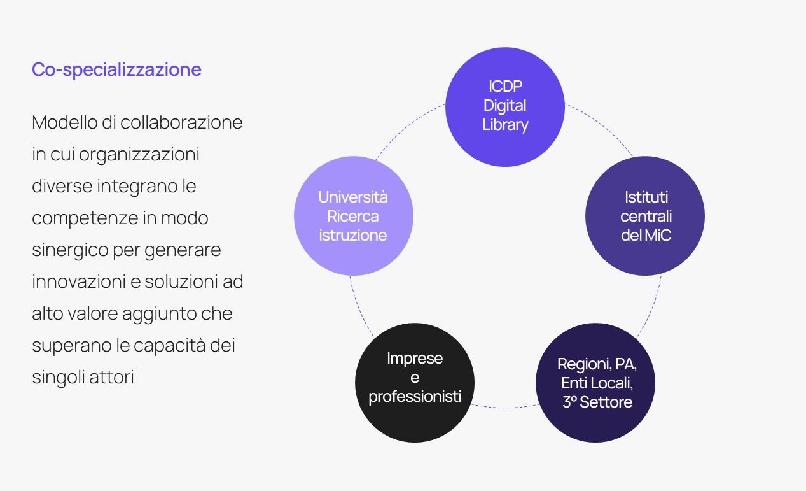

Ecomic, contesto e strategia
=============================

Il presente capitolo fornisce il quadro strategico di riferimento di Ecomic, inquadrandolo all’interno delle politiche pubbliche per la digitalizzazione 
del patrimonio culturale, in particolare il Piano Nazionale di Ripresa 
e Resilienza (PNRR) e il Piano Nazionale di Digitalizzazione del patrimonio culturale (PND). Ecomic si configura come un ambiente digitale integrato che connette Attori, dati e strumenti, orientato alla generazione di valore pubblico in ambito culturale. Nel capitolo vengono presentate le sfide sistemiche che interessano la trasformazione digitale del settore culturale 
e le opportunità offerte dalle tecnologie di Ecomic.

Viene inoltre descritta l’articolazione degli obiettivi strategici che orientano la crescita dell’ecosistema e viene proposta una segmentazione dei suoi portatori di interesse, organizzati secondo la classificazione funzionale 
del PND. Questo assetto prepara l’analisi operativa dei ruoli e delle relazioni tra Attori che verrà approfondita nel capitolo successivo.

Contesto di riferimento
-----------------------

Il PNRR e l’investimento M1C3 1.1
~~~~~~~~~~~~~~~~~~~~~~~~~~~~~~~~~

Ecomic nasce nell’ambito della Missione 1 Componente 3 del Piano Nazionale di Ripresa e Resilienza (PNRR), Investimento 1.1 “Strategie 
e piattaforme digitali per il patrimonio culturale”, coordinato dall’Istituto centrale per la digitalizzazione del patrimonio culturale – Digital Library. L’obiettivo è duplice: da un lato realizzare una digitalizzazione estesa del patrimonio culturale italiano, dall’altro costruire un’infrastruttura nazionale in grado di garantire la raccolta, la gestione 
e l'accessibilità dei dati culturali. 

L’investimento è articolato in dodici sub-investimenti tra loro interconnessi e adotta un modello di governance orientato a superare 
la frammentazione progettuale, valorizzare le competenze esistenti 
e incentivare la collaborazione promuovendo un ecosistema digitale cooperativo e interoperabile. 

Il Piano Nazionale di Digitalizzazione (PND)
~~~~~~~~~~~~~~~~~~~~~~~~~~~~~~~~~~~~~~~~~~~~

Il Piano Nazionale di Digitalizzazione (PND) rappresenta il quadro 
di riferimento strategico e operativo del Ministero della Cultura 
per guidare la trasformazione digitale del settore culturale. 
La sua visione si orienta su tre obiettivi fondamentali:

- supportare le capacità operative degli istituti culturali attraverso strumenti e servizi digitali;
- favorire l’integrazione tra dati, sistemi e processi in una logica ecosistemica;
- generare nuovo valore culturale, sociale ed economico a partire 
dal patrimonio digitale.

Il PND sottolinea anche 
la necessità di promuovere una visione olistica 
e partecipata del patrimonio culturale, riconoscendo il valore delle pratiche narrative e dei contesti di fruizione: in quest’ottica, il digitale diventa leva di cittadinanza attiva, oltre che strumento di tutela e valorizzazione. Ecomic vuole essere lo spazio 
in cui la visione del PND 
si realizza operativamente, traducendone i principi 
in soluzioni tecnologiche concrete.

Il contesto europeo
~~~~~~~~~~~~~~~~~~~

Il panorama europeo ha conosciuto negli ultimi anni un’accelerazione significativa nella digitalizzazione del patrimonio culturale, che ha assunto un ruolo strategico crescente per la creazione di valore pubblico e privato. Le principali iniziative convergono su alcuni principi cardine:

- apertura e interoperabilità dei dati;
- partecipazione attiva dei pubblici;
- sviluppo di infrastrutture condivise per la ricerca, 
la conservazione e l’innovazione basata su tecnologie avanzate.

Europeana, ad esempio, è l’infrastruttura di riferimento dell’Unione Europea per l’aggregazione e l’accesso ai contenuti culturali digitali 
e promuove l’adozione di standard comuni per la metadazione, l’accesso 
e il riuso. È una delle principali fonti di ispirazione per Ecomic 
nella progettazione di un’infrastruttura interoperabile e federata.

Al centro della strategia europea si colloca la Cultural Heritage Cloud, un’infrastruttura cloud transdisciplinare accessibile anche a istituzioni piccole e remote, e il Common European Data Space, uno spazio dati sicuro e federato, in cui i contenuti possano essere raccolti, gestiti, condivisi e riutilizzati secondo gli standard FAIR (Findable, Accessible, Interoperable, Reusable).

Altri progetti rilevanti includono Time Machine, dedicato alla ricostruzione spazio-temporale del passato europeo attraverso dati storici e modelli computazionali, e ECHOES, progetto Horizon Europe per l’elaborazione semantica dei dati culturali. 

In questo ecosistema in evoluzione, Ecomic si colloca come iniziativa strategica nazionale allineata con le linee guida europee, sia nella visione (ecosistemica, partecipativa, distribuita) sia nelle tecnologie adottate (*open source*, *Linked Open Data*, *API*, grafi di conoscenza). 
Il modello organizzativo e infrastrutturale ne fa un candidato naturale 
al dialogo con i progetti europei, contribuendo a portare nel contesto comunitario le specificità del patrimonio culturale italiano.

Ecomic non si limita a replicare esperienze europee, 
ma le interpreta e rielabora nel quadro della strategia nazionale definita dal PND, offrendo un contributo distintivo alla costruzione dell’infosfera culturale europea.

Il concetto di ecosistema
~~~~~~~~~~~~~~~~~~~~~~~~~

Nel contesto della trasformazione digitale descritta nel PND, il termine *ecosistema digitale* non è inteso come un semplice insieme di strumenti tecnologici o di infrastrutture digitali, ma richiama una rete dinamica 
e interconnessa di soggetti, dati, processi, tecnologie e pratiche, orientata alla generazione di valore pubblico condiviso. 
Questo concetto è strettamente legato alla logica del dato come servizio - 
*Data as a Service*, *Knowledge as a Service* - secondo la quale la cultura digitale diventa un ambiente generativo, capace di produrre nuova conoscenza, innovazione sociale, contenuti creativi e modelli educativi.

Ecomic adotta e interpeta questo paradigma configurandosi come 
uno spazio digitale e organizzativo in cui convivono infrastrutture tecnologiche, standard comuni, dati e modelli di cooperazione tra soggetti diversi. Attraverso l’adozione di tecnologie interoperabili e la promozione 
di pratiche collaborative, Ecomic è un ecosistema capace di adattarsi, crescere e innovare nel tempo. Ecomic non impone un unico modello di gestione del patrimonio digitale, ma offre un contesto abilitante plurale, dove ciascun Attore – pubblico o privato, istituzionale o comunitario – può riconoscersi, partecipare e contribuire secondo le proprie competenze 
e missioni. Questo modello si propone come superamento consapevole dell’approccio verticale e centralizzato alla gestione del patrimonio, storicamente riconducibile a quello che Laurajane Smith ha definito Authorised Heritage Discourse (AHD). L’AHD si fonda su una visione gerarchica e oggettivante della cultura, in cui la legittimità del sapere 
e del valore culturale è attribuita quasi esclusivamente a istituzioni centrali e figure esperte, escludendo narrazioni alternative o comunitarie. 

Ecomic, pur riconoscendo il valore imprescindibile delle competenze specialistiche e l’importanza degli strumenti normativi – oggi tanto più cruciali in un contesto reso complesso da intelligenza artificiale, automazione e riproducibilità – propone di superare i modelli autoritativi 
di governance applicati ai domini della cultura, per incoraggiare l’adozione di nuovi paradigmi relazionali e collaborativi. Nel paradigma ecosistemico, la cultura non è soltanto oggetto di tutela ma anche spazio 
di co-produzione, co-creazione e co-specializzazione. L’ecosistema non è quindi solo un’infrastruttura tecnologica ma uno spazio abilitante 
per la costruzione condivisa di significato e utilità pubblica, attraverso l’interazione tra comunità, istituzioni e tecnologie. Per comprendere appieno la portata trasformativa di questo approccio, è necessario richiamare i riferimenti teorici e metodologici su cui esso si fonda.

Basi concettuali e riferimenti teorici
--------------------------------------

Digitalizzazione come trasformazione culturale
~~~~~~~~~~~~~~~~~~~~~~~~~~~~~~~~~~~~~~~~~~~~~~

Il passaggio dalla digitalizzazione intesa come mera conversione tecnica 
a quella concepita come trasformazione culturale costituisce 
uno dei principali paradigmi di riferimento per la strategia di Ecomic. 
In tale prospettiva, la cultura digitale non è solo un contenitore di contenuti, ma un ambiente che modella pratiche, linguaggi, relazioni 
e nuove forme di conoscenza. Questo approccio, richiamato nel PND, 
è coerente con le riflessioni di Bolter e Grusin sulla *remediation*, ovvero 
il modo in cui i nuovi media rielaborano e rifunzionalizzano i media precedenti, non semplicemente riproducendoli, ma traducendoli in nuove logiche espressive e d’uso. In altre parole, come sottolinea Roberto Balzani, «La cultura digitale ha senso se capace di costruire ambienti, non solo archivi. Solo così il patrimonio si trasforma 
in piattaforma per la cittadinanza».

In questo contesto, Ecomic assume i beni digitali, e in particolare 
i metadati e le descrizioni, come risorse computabili, semantiche 
e relazionali. È un approccio pienamente in linea con quanto affermato 
nel PND e da autori come Eero Hyvönen, secondo cui la conoscenza culturale deve essere strutturata in modo da supportare inferenze automatiche, esplorazioni tematiche e servizi intelligenti. 
La logica del *Knowledge as a Service* (KaaS) implica infatti che i dati siano accessibili come elementi attivi per la generazione di narrazioni, interpretazioni, applicazioni educative e creative. È in questa direzione che si collocano l’utilizzo di grafi di conoscenza, *Linked Open Data*, tecnologie *open source* *e interoperabili, con l’obiettivo di abilitare una cultura computabile, connessa e generativa. Questo approccio intende dare attuazione ai principi dell’articolo 9 della Costituzione, estendendo 
la tutela e la promozione della cultura e della ricerca al patrimonio digitale e ai nuovi contesti di produzione e condivisione della conoscenza. 

Co-creazione e modelli partecipativi
~~~~~~~~~~~~~~~~~~~~~~~~~~~~~~~~~~~~

L’ecosistema promuove forme di co-creazione e partecipazione attiva, riflettendo un cambiamento culturale profondo che riguarda il ruolo 
del pubblico: da semplice destinatario a soggetto attivo nella produzione di nuovo valore. Come evidenziato nel PND, le pratiche di crowdsourcing e design partecipato rappresentano strumenti fondamentali per attivare 
le comunità, generare fiducia e costruire servizi efficaci. Ecomic integra questi approcci, facilitando la creazione di ambienti digitali e modelli 
di governance orientati all’inclusione.

Tale orientamento trova fondamento nella consapevolezza che 
il patrimonio culturale non può essere disgiunto dalle pratiche narrative che lo attraversano e lo rendono rilevante per le comunità. Non si tratta semplicemente di trasmettere contenuti, ma di abilitare spazi in cui 
le persone possano riconoscersi, dialogare, reinterpretare e trasformare 
il patrimonio attraverso i propri vissuti e saperi. In questa prospettiva, coerente con quanto sostenuto in ambito educativo e museale da recenti studi pluridisciplinari, la partecipazione non è solo uno strumento operativo, ma una condizione costitutiva della valorizzazione. 
Il patrimonio digitale, per diventare risorsa condivisa, deve essere continuamente rinarrato e attualizzato all’interno di relazioni significative, capaci di generare senso, appartenenza e responsabilità collettiva.

Co-specializzazione e modelli organizzativi innovativi
~~~~~~~~~~~~~~~~~~~~~~~~~~~~~~~~~~~~~~~~~~~~~~~~~~~~~~

La complessità strutturale e l’estensione della copertura territoriale dell’ecosistema digitale per la cultura richiedono modelli organizzativi capaci di superare la frammentazione e favorire una cooperazione sistemica tra Attori con competenze, ruoli e responsabilità eterogenei. 
In questo contesto, Ecomic adotta un modello organizzativo fondato 
sulla co-specializzazione, intesa come dinamica collaborativa 
in cui soggetti diversi – istituzioni pubbliche, imprese private, enti 
di ricerca, operatori culturali – contribuiscono allo sviluppo dell’ecosistema mettendo a fattor comune le proprie capacità specifiche.

Tale approccio si differenzia dalla semplice cooperazione funzionale, perché promuove una forma di interdipendenza evolutiva, in cui ogni Attore, attraverso l’interazione con gli altri, è posto nelle condizioni di accrescere le proprie competenze, generare soluzioni più efficaci 
e affrontare sfide complesse in modo condiviso. La co-specializzazione consente così la creazione di valore aggiunto in modalità distribuita, accelerando l’innovazione e abilitando nuove opportunità di crescita 
per tutti i partecipanti.

Questa prospettiva si inserisce nel solco dei modelli reticolari descritti 
da Powell e sviluppati in ambito amministrativo da Ansell e Gash, 
che evidenziano come la cooperazione tra soggetti pubblici e privati, se strutturata intorno a obiettivi condivisi e supportata da adeguati strumenti di coordinamento, possa produrre soluzioni resilienti e sostenibili. 
In tal senso, Ecomic si configura come una infrastruttura organizzativa abilitante, in grado di sostenere processi di apprendimento collettivo 
e innovazione continua, coerentemente con quanto auspicato nel PND 
e in linea con quanto proposto da Cerullo e Negri in merito al ruolo 
delle architetture digitali distribuite per la costruzione di un ecosistema nazionale del patrimonio culturale. 

Figura 1 | Co-specializzazione

Valore pubblico e sostenibilità
~~~~~~~~~~~~~~~~~~~~~~~~~~~~~~~

Il concetto di valore pubblico è il fondamento della visione di Ecomic, 
in coerenza con le riflessioni di Mark H. Moore e Mariana Mazzucato. Secondo Moore, creare valore pubblico significa produrre benefici collettivi che siano al contempo socialmente rilevanti, politicamente legittimati 
e operativamente sostenibili. Significa rispondere in maniera proattiva 
a bisogni reali della collettività, rafforzando il legame fiduciario tra cittadini e istituzioni. Mazzucato amplia questa prospettiva: lo Stato non deve limitarsi a correggere le disfunzioni del mercato, ma assumere 
un ruolo proattivo nella co-creazione del valore, guidando trasformazioni orientate al benessere sociale, culturale e ambientale. 
In tale ottica, la valorizzazione del patrimonio digitale è un processo generativo di impatti duraturi che non subordina la dimensione culturale 
a quella commerciale.

In questo quadro, Ecomic si propone come ambiente abilitante per 
la creazione di valore pubblico in ambito culturale. L'ecosistema attiva cooperazione e co-produzione tra Attori eterogenei – istituzioni, imprese, enti di ricerca – tramite una governance distribuita e orientata alla co-specializzazione. Il valore generato da Ecomic si manifesta nella sua capacità di abilitare servizi digitali inclusivi, accessibili e orientati all'impatto culturale, educativo, civico ed economico dei dati culturali. Ecomic promuove la riappropriazione collettiva del patrimonio attraverso il digitale: ogni risorsa o dato è base per l’apprendimento, 
per la costruzione di nuovi contenuti e di identità condivise.

In coerenza con il PND e l’Agenda 2030 per lo Sviluppo Sostenibile, Ecomic non si limita a essere una risposta tecnologica alla frammentazione del settore, ma ambisce a diventare un elemento strutturale di politica pubblica, capace di promuovere modelli di innovazione orientati al benessere collettivo e alla sostenibilità del patrimonio culturale italiano. 

Sfide e opportunità della trasformazione digitale in ambito culturale
-----------------------------------------------------------------------

La trasformazione digitale del patrimonio culturale in Italia è al centro di una transizione strategica che coinvolge istituzioni, professionisti, enti locali, cittadini e imprese, chiamati 
ad affrontare sfide complesse di natura tecnologica, organizzativa e formativa. Tali sfide coesistono con importanti opportunità, attivate sia dal quadro normativo e strategico delineato dal PNRR e dal PND, sia dalla crescita delle competenze digitali nel settore. Ecomic nasce 
per rispondere a tali sfide. Il suo sviluppo si fonda su una conoscenza approfondita dei bisogni emersi attraverso le attività di ascolto e analisi della domanda condotte da Digital Library già in fase preliminare alla pubblicazione del PND​.

Frammentazione e disomogeneità dei dati
~~~~~~~~~~~~~~~~~~~~~~~~~~~~~~~~~~~~~~~

.. list-table::
   :header-rows: 1
   :widths: 50 50
   :class: longtable

   * - **Sfida**
     - **Opportunità**
   * - | La digitalizzazione del patrimonio culturale italiano
       | è stata per lungo tempo guidata da iniziative
       | autonome e non coordinate, portando alla
       | proliferazione di sistemi informativi locali, talvolta
       | incompatibili tra loro, con scarsa accessibilità delle
       | risorse e livelli disomogenei di metadatazione.
       |
       | Secondo una recente analisi, solo il 50% degli enti
       | che hanno avviato attività di digitalizzazione rende
       | poi accessibili i contenuti online (Osservatorio
       | Innovazione Digitale nella Cultura, 2023).
       |
       | Questa frammentazione limita non solo l'efficienza
       | operativa ma anche le possibilità di riuso e di
       | connessione cross-dominio dei dati, riducendo
       | l'impatto potenziale dei beni digitali.
     - | Il PND individua l'interoperabilità come principio
       | cardine per abilitare ecosistemi digitali cooperativi
       | e interdipendenti, e similmente opera Ecomic,
       | basato su un'infrastruttura semantica che mette
       | in relazione contesti diversi attraverso l'uso di
       | grafi di conoscenza.
       |
       | Tra le principali innovazioni di Ecomic, tali
       | strutture, anche grazie all'uso di modelli di
       | intelligenza artificiale, consentono di descrivere e
       | correlare beni digitali di qualsiasi dominio
       | (archivistico, bibliografico, museale, ecc.), natura
       | e provenienza, attivando connessioni semantiche
       | inedite e cross-dominio.
       |
       | Questo approccio abilita lo sviluppo di servizi
       | *Knowledge as a Service (KaaS)*, in cui i dati
       | diventano risorse computabili e riusabili.

Fragilità organizzative e modelli gestionali obsoleti
~~~~~~~~~~~~~~~~~~~~~~~~~~~~~~~~~~~~~~~~~~~~~~~~~~~~~

.. list-table::
   :header-rows: 1
   :widths: 50 50
   :class: longtable

   * - **Sfida**
     - **Opportunità**
   * - | La transizione al digitale ha messo in evidenza
       | lacune strutturali delle strutture organizzative
       | di molte istituzioni culturali rispetto alla
       | complessità dei processi digitali.
       |
       | La mancanza di figure dedicate, l'assenza di
       | strumenti operativi flessibili e la carenza di
       | metodologie aggiornate rendono difficile integrare
       | nei flussi di lavoro pratiche orientate
       | all'innovazione.
       |
       | Questo scenario ostacola la progettazione e la
       | gestione sostenibile del patrimonio digitale,
       | evidenziando la necessità di rafforzare il
       | coordinamento e adottare modelli operativi più agili.
     - | In coerenza con il PND, Ecomic adotta un modello
       | organizzativo ispirato al "Government as a Platform",
       | in cui l'infrastruttura pubblica abilita la
       | co-produzione di servizi attraverso strumenti
       | condivisi (O'Reilly, 2011).
       |
       | Questo approccio, teorizzato anche da Cordella &
       | Paletti, permette di valorizzare le competenze e
       | favorire la cooperazione (Cordella & Paletti, 2019).
       |
       | L'introduzione di logiche iterative e adattive e
       | ambienti digitali scalabili consente agli enti
       | culturali di partecipare in modo flessibile e
       | progressivo alla costruzione dell'ecosistema,
       | ridefinendo ruoli, processi e strumenti.

Competenze e profili professionali inadeguati
~~~~~~~~~~~~~~~~~~~~~~~~~~~~~~~~~~~~~~~~~~~~~

.. list-table::
   :header-rows: 1
   :widths: 50 50
   :class: longtable

   * - **Sfida**
     - **Opportunità**
   * - | I profili professionali tradizionali non risultano
       | sufficienti per gestire l'evoluzione tecnologica del
       | settore culturale. Inoltre, mancano spesso percorsi
       | formativi specifici, sistemi di aggiornamento
       | continuativo e riconoscimento istituzionale per le
       | professionalità emergenti nel settore digitale.
       |
       | Anche recenti progettualità europee hanno evidenziato
       | l'urgenza di ridefinire i profili professionali della
       | cultura digitale e di investire nella formazione
       | continua.
       |
       | A ciò si aggiunge la fragilità contrattuale e
       | progettuale di molti operatori, in particolare
       | freelance e PMI culturali.
       |
       | La carenza di competenze digitali e l'assenza di
       | percorsi strutturati di formazione e aggiornamento
       | rappresentano una barriera significativa.
     - | Il PND identifica la formazione continua come leva
       | strategica per rafforzare la capacità degli operatori
       | culturali di affrontare la trasformazione digitale.
       | In questa direzione, Ecomic integra strumenti e
       | percorsi accessibili per sostenere lo sviluppo di
       | competenze digitali, tecniche e progettuali.
       |
       | L'iniziativa "Dicolab. Cultura al digitale",
       | realizzata dalla Fondazione Scuola nazionale del
       | patrimonio e delle attività culturali in
       | collaborazione con Digital Library, offre percorsi
       | formativi rivolti a studenti, professionisti del
       | settore e cittadini, contribuendo alla crescita di
       | una nuova generazione di professionisti capaci di
       | operare in ambienti digitali complessi. Altri
       | progetti come "TAP - Tutoring e accompagnamento
       | progetti" e "Digital MAB" supportano lo sviluppo
       | di nuove competenze e la diffusione di pratiche
       | collaborative tra istituzioni e professionisti.

Disparità nell’accesso alle tecnologie e ai servizi digitali
~~~~~~~~~~~~~~~~~~~~~~~~~~~~~~~~~~~~~~~~~~~~~~~~~~~~~~~~~~~~

.. list-table::
   :header-rows: 1
   :widths: 50 50
   :class: longtable

   * - **Sfida**
     - **Opportunità**
   * - | La rapida evoluzione delle tecnologie abilitanti --
       | IA, XR, ambienti immersivi, interfacce adattive --
       | rende difficile per molte istituzioni culturali
       | valutare e integrare soluzioni digitali innovative.
       |
       | Le barriere economiche, la frammentazione
       | dell'offerta e la mancanza di contesti sperimentali
       | accessibili limitano l'adozione di questi strumenti
       | da parte di enti culturali medio-piccoli.
       |
       | A ciò si aggiunge la difficoltà nel reperire
       | competenze aggiornate e nella costruzione di
       | partenariati tecnici efficaci, elementi
       | indispensabili per attivare percorsi di innovazione
       | sostenibili e coerenti con le reali esigenze dei
       | territori.
       |
       | Questa disparità amplifica il divario tra territori
       | e alimenta una dinamica di esclusione
       | dall'innovazione.
     - | La digitalizzazione deve abilitare servizi che
       | rispondano ai bisogni di fruizione, partecipazione
       | e innovazione espressi dai pubblici, promuovendo
       | nuove modalità di accesso e interpretazione del
       | patrimonio culturale (Agostino & Costantini, 2021).
       |
       | Il PND riconosce la necessità di creare condizioni
       | abilitanti comuni che riducano i divari tecnologici
       | tra territori e tra istituzioni.
       |
       | Coerentemente, Ecomic mira ad ampliare la platea di
       | soggetti in grado di adottare soluzioni digitali
       | complesse, promuovendo una digitalizzazione più equa
       | e sostenibile su scala nazionale.
       |
       | Ecomic si configura come spazio abilitante per la
       | sperimentazione, la condivisione e il riuso di
       | tecnologie già sviluppate, riducendo i costi di
       | accesso all'innovazione.

Crisi di senso del patrimonio culturale
~~~~~~~~~~~~~~~~~~~~~~~~~~~~~~~~~~~~~~~

.. list-table::
   :header-rows: 1
   :widths: 50 50
   :class: longtable

   * - **Sfida**
     - **Opportunità**
   * - | Negli ultimi anni si osserva una crescente distanza
       | tra patrimonio culturale e società, testimoniata da
       | fenomeni diffusi di disaffezione, in particolare
       | tra le giovani generazioni.
       |
       | La percezione del patrimonio come qualcosa di
       | separato dalla vita quotidiana, da un lato, e
       | l'eccessiva musealizzazione o spettacolarizzazione,
       | dall'altro, contribuiscono a una crisi di senso che
       | investe il ruolo culturale delle istituzioni.
       |
       | In letteratura, questo fenomeno è definito dal
       | concetto di "patrimonio dissonante", ossia portatore
       | di significati molteplici, talvolta in conflitto tra
       | loro, che difficilmente trovano pieno riconoscimento
       | nei processi istituzionali di tutela e valorizzazione
       | (Tunbridge & Ashworth, 1996).
     - | Uno degli assi strategici del PND è la valorizzazione
       | dei contesti culturali come paesaggi dinamici e
       | relazionali, capaci di accogliere narrazioni
       | diversificate e forme di partecipazione attiva.
       |
       | Attraverso servizi abilitanti e tecnologici e modelli
       | partecipativi, Ecomic consente di ampliare l'accesso
       | e il riuso dei dati culturali, costruendo nuovi
       | "percorsi di senso" condivisi e aderenti alla
       | pluralità dei vissuti contemporanei.
       |
       | Il patrimonio è inteso come bene pubblico orientato
       | al futuro, in cui le comunità possono riconoscersi,
       | contribuire e progettare nuove forme di appartenenza
       | culturale. Ecomic diventa così un'opportunità per
       | rigenerare il legame tra patrimonio e società,
       | restituendo centralità al ruolo pubblico della
       | cultura.

Debolezza delle filiere culturali e difficoltà di valorizzazione sostenibile
~~~~~~~~~~~~~~~~~~~~~~~~~~~~~~~~~~~~~~~~~~~~~~~~~~~~~~~~~~~~~~~~~~~~~~~~~~~~

.. list-table::
   :header-rows: 1
   :widths: 50 50
   :class: longtable

   * - **Sfida**
     - **Opportunità**
   * - | Il settore delle imprese culturali e creative (ICC)
       | in Italia, pur contando su eccellenze tecnologiche
       | e progettuali, risulta ancora fragile, poco
       | strutturato e scarsamente connesso con le
       | infrastrutture pubbliche.
       |
       | La debole rappresentanza del settore -- fatta
       | eccezione per comparti come editoria e pubblicità --
       | ne limita l'incidenza sulle politiche pubbliche e
       | lo sviluppo di modelli strutturati.
       |
       | L'accesso oneroso a dati e infrastrutture frena la
       | nascita di nuove iniziative e la crescita di quelle
       | esistenti. Come rilevato dal rapporto "Io sono
       | cultura", le ICC italiane soffrono di fragilità
       | organizzative e infrastrutturali che ne ostacolano
       | il pieno potenziale innovativo (Symbola --
       | Fondazione per le qualità italiane, e Unioncamere,
       | 2023).
     - | Ecomic si configura come acceleratore della crescita
       | del settore culturale e creativo.
       |
       | Senza sostituirsi ai servizi offerti dal mercato, ne
       | valorizza le energie creative attraverso l'apertura
       | dei dati, l'interoperabilità, la riduzione dei costi
       | di accesso e la messa a disposizione di strumenti
       | condivisi.
       |
       | Il PND richiama esplicitamente l'importanza di
       | promuovere modelli di valorizzazione che non
       | subordinino il valore culturale alla monetizzazione,
       | ma lo esprimano in forme economiche, sociali e
       | civiche tra loro complementari.
       
Obiettivi
---------
L’apparato di obiettivi adottato da Ecomic è essenziale per guidare la trasformazione digitale del patrimonio culturale in modo coerente, misurabile e adattivo. Consente di orientare 
le azioni, misurare i risultati, allocare risorse in modo efficiente e valutare l’efficacia degli interventi. L’architettura concettuale e tecnica di Ecomic si fonda su tre obiettivi cardine – Abilitazione, Interoperabilità e Valorizzazione – mutuati dal PND. A ciascun sono riferibili obiettivi specifici per i tre sistemi abilitanti del nucleo tecnologico dell'ecosistema (D.PaC, I.PaC, DPaaS) che misurano e verificano il contributo attivo di ciascun sistema al raggiungimento 
degli obiettivi strategici.

Questa articolazione multilivello garantisce l’allineamento strategico con la visione sistemica 
del PND, assicura la coerenza tecnica, operativa e relazionale delle azioni intraprese, e consente di valutare l’efficacia dell’iniziativa nel cogliere le opportunità offerte dal contesto attuale. 
Tutti gli obiettivi sono formulati secondo criteri di efficacia e *accountability*, secondo il principio SMART (Specifici, Misurabili, Accessibili, Rilevanti, Temporizzati). Ciascun obiettivo è associato 
a dei *Key Performance Indicator* (KPI) esemplificativi che offrono la base per il monitoraggio continuo dei progressi e la rendicontazione trasparente dell'impatto generato. 

.. list-table::
   :header-rows: 1
   :widths: 25 75
   :align: left

   * - **Obiettivo Ecomic**
     - **Corrispondente obiettivo PND**
   * - **Abilitazione**
     - | Ampliare le forme di accesso al patrimonio digitale per migliorare 
       | l'inclusione culturale. A livello orizzontale, ampliando la quantità
       | di risorse digitali disponibili online; a livello verticale, migliorando
       | la qualità dell'accesso, le modalità di fruizione e di riuso. [§5.2.1]
   * - **Interoperabilità**
     - | Abilitare ecosistemi interdipendenti, muovendo dai sistemi verticali 
       | (silos di dati) a un'infrastruttura comune distribuita e dai database 
       | chiusi ai sistemi aperti, sviluppando sistemi informativi relazionabili
       | e interoperabili. [§5.2.3]
   * - **Valorizzazione**
     - | Digitalizzare per operare una trasformazione digitale, includendo 
       | non solo i beni culturali ma anche i processi interni e i servizi 
       | all'utenza, abilitando in questi ultimi un miglioramento continuo. [§5.2.2]

Tabella 1 | Obiettivi di Ecomic

Obiettivo 1 – Abilitazione
~~~~~~~~~~~~~~~~~~~~~~~~~~

Finalità: Accrescere la capacità degli Attori culturali di produrre, gestire 
e valorizzare beni digitali, accrescendo la maturità digitale nel settore

Descrizione: Ecomic promuove un modello inclusivo e progressivo di trasformazione digitale, in cui ogni ente è supportato nel percorso di maturità digitale. Attraverso un'infrastruttura pubblica aperta e modelli organizzativi orientati alla collaborazione, l’ecosistema mette a disposizione strumenti scalabili e servizi complementari che garantiscano la partecipazione anche di soggetti con competenze o risorse limitate. L’obiettivo è superare disomogeneità e frammentazione, generando valore per tutti.

Formula SMART: Entro il 2030, coinvolgere almeno 500 istituti culturali in percorsi strutturati di crescita digitale supportati dall’adozione di piattaforme e servizi Ecomic. 

KPI esemplificativi: Tasso di crescita media della maturità digitale (su base territoriale o tipologica); Percentuale di Enti titolari di beni digitali che sfruttano servizi Ecomic afferenti ad almeno due fasi del ciclo (es. produzione + gestione); Livello di soddisfazione degli enti rispetto al supporto ricevuto.

Obiettivo 2 – Interoperabilità
~~~~~~~~~~~~~~~~~~~~~~~~~~~~~~

Finalità: Favorire l’integrazione tra sistemi, Attori e dati per generare un’infrastruttura culturale distribuita, cooperativa e semantica

Descrizione: Per Ecomic l'interoperabilità è un principio sistemico che agisce 
sul piano tecnico, semantico e organizzativo. Attraverso servizi e strumenti basati su modalità federate, standard aperti e modelli semantici comuni, l’ecosistema abilita una gestione condivisa e scalabile dei beni digitali. L’interoperabilità si traduce anche nella capacità di attivare collaborazioni stabili tra Attori pubblici e privati, valorizzando le competenze di ciascuno in una logica di co-specializzazione. Digital Library supporta questo processo attraverso il ccordinamento di iniziative collaborative, l’uso di strumenti di procurement innovativo e la definizione di assetti organizzativi adeguati.

Formula SMART: Entro il 2030, attivare almeno 300 iniziative di cooperazione applicativa  e progettuale 
tra enti, sistemi e strumenti afferenti a Ecomic, supportate da strumenti di co-progettazione e/o procurement. 

KPI esemplificativi: Numero di progetti multi-attore finanziati o coordinati; numero di partenariati attivati tra enti culturali, imprese e istituzioni; numero di strumenti attivati: concorsi, dialoghi competitivi, accordi quadro, avvisi pubblici (ecc.); grado di soddisfazione o coinvolgimento dei partner (es. survey ex post).

Obiettivo 3 – Valorizzazione
~~~~~~~~~~~~~~~~~~~~~~~~~~~~

Finalità: Trasformare i beni digitali in valore culturale, educativo, sociale 
ed economico attraverso il riuso e l’innovazione

Descrizione: Ecomic sostiene la valorizzazione del patrimonio digitale come leva 
di innovazione e sviluppo. I sistemi e i servizi dell’ecosistema facilitano la creazione 
di prodotti culturali, esperienze interattive, strumenti educativi, servizi di accessibilità e soluzioni di co-creazione, trasformando la conoscenza in impatti tangibili 
per pubblici diversi. Il valore generato non è solo economico, ma anche civico 
e cognitivo, e si distribuisce tra istituzioni, territori e cittadini. Digital Library guida questo processo favorendo l’interconnessione tra domini, Attori e contesti, 
e misurando gli impatti generati.

Formula SMART: Entro il 2030, abilitare almeno 300 iniziative ad alto impatto culturale, educativo o economico basate sul riuso dei beni digitali e sullo sviluppo di prodotti e servizi tramite l'ecosistema. 

KPI esemplificativi: Indicatori qualitativi di impatto (raccolta feedback, studi di caso, analisi); valore economico diretto e indiretto generato (ove rilevabile); numero di prodotti/servizi Knowledge as a Service (KaaS)  abilitati, app educative, esperienze immersive o interattive realizzate; Numero di imprese culturali e creative coinvolte 
in attività di sviluppo o riuso; Tasso di riutilizzo dei prodotti/servizi abilitati/potenziati da Ecomic.

I portatori di interesse di Ecomic
----------------------------------

Segmentazione dei portatori di interesse
~~~~~~~~~~~~~~~~~~~~~~~~~~~~~~~~~~~~~~~~

Il PND e le linee guida del PNRR evidenziano l’importanza di coinvolgere una pluralità di soggetti nella trasformazione digitale del patrimonio culturale. Ecomic assume questo principio come fondamento, riconoscendo che il valore nasce dall’integrazione di competenze e risorse complementari. Questa sezione riprende la mappatura strategica del PND, che organizza 
i portatori di interesse in tre segmenti, in base al loro ruolo nella gestione e valorizzazione 
del patrimonio digitale:

- Segmento consolidato: enti pubblici e privati già titolari di patrimoni culturali e attivamente coinvolti nella loro gestione;
- Segmento operativo: soggetti che svolgono funzioni professionali e tecniche legate alla valorizzazione, gestione e digitalizzazione del patrimonio;
- Segmento aperto: soggetti esterni al perimetro tradizionale della tutela e della gestione, ma potenzialmente interessati a riutilizzare o valorizzare i contenuti digitali.

Segmento consolidato
~~~~~~~~~~~~~~~~~~~~

Enti pubblici e privati titolari di beni culturali
^^^^^^^^^^^^^^^^^^^^^^^^^^^^^^^^^^^^^^^^^^^^^^^^^^

Rientrano in questa categoria tutti i soggetti che detengono, gestiscono o valorizzano beni culturali in forma fisica o digitale. Questi enti, spesso caratterizzati da eterogeneità nei sistemi e nei livelli di maturità digitale, necessitano di strumenti per avviare e ottimizzare i processi di digitalizzazione, garantire la conservazione a lungo termine e abilitare servizi digitali personalizzati. Ecomic mette a loro disposizione infrastrutture comuni e servizi abilitanti, facilitando l’accesso a competenze, dati e tecnologie, oltre alla possibilità di partecipare ad un contesto cooperativo su scala nazionale.

Esempi: Musei, archivi, biblioteche, soprintendenze, istituzioni ecclesiastiche, fondazioni 
e altri soggetti pubblici o privati titolari di beni culturali materiali o digitali.

Enti regionali, nazionali e internazionali
^^^^^^^^^^^^^^^^^^^^^^^^^^^^^^^^^^^^^^^^^^

Questi soggetti assicurano il coordinamento strategico dei servizi pubblici legati 
ai beni culturali a diversi livelli territoriali. Ecomic riconosce loro un ruolo chiave nelle attività legate alla governance del patrimonio digitale, promuovendo l’integrazione tra le iniziative regionali, nazionali e sovranazionali, o afferenti a diversi domini della cultura. Ecomic abilita sinergie tra sistemi locali, infrastrutture nazionali e internazionali, con l’obiettivo 
di rafforzare la visibilità e valorizzare il patrimonio culturale italiano nel suo complesso.

Esempi: Istituti centrali del MiC (ICAR, ICCD, ICCU, ICBSA), Regioni e Province autonome, 
con piattaforme digitali culturali attive o in fase di sviluppo (es. Alphabetica, Catalogo generale dei beni culturali, Piemonte Italia Cultura, Cultura Campania, Cultura Toscana, PatER), soggetti che collaborano con infrastrutture europee o progetti internazionali in ambito culturale.

Segmento operativo
~~~~~~~~~~~~~~~~~~

Professionisti e imprese della valorizzazione culturale
^^^^^^^^^^^^^^^^^^^^^^^^^^^^^^^^^^^^^^^^^^^^^^^^^^^^^^^

Tra questi soggetti si annoverano figure ad alta specializzazione e le categorie professionali legate ai beni culturali. Queste persone spesso lavorano in condizioni 
di instabilità contrattuale e discontinuità progettuale, pur rappresentando un bacino di eccellenza con competenze diffuse. Grazie a Ecomic, questi professionisti possono accedere a contenuti e strumenti per progettare servizi digitali, partecipare e organizzare percorsi formativi, collaborare alla costruzione di soluzioni innovative in logica 
di co-specializzazione. La loro partecipazione è fondamentale per attivare esperienze 
di fruizione significative e inclusive.

Esempi: curatori, storici dell’arte, restauratori, bibliotecari, archeologi, umanisti digitali, progettisti culturali, professionisti digitali, della produzione e della mediazione culturale.

Università e Istituti di ricerca
^^^^^^^^^^^^^^^^^^^^^^^^^^^^^^^^

Il mondo della ricerca è un nodo strategico per lo sviluppo concettuale, tecnologico 
e formativo dell’ambiente digitale per la cultura. Ecomic consente ad atenei e centri specializzati di accedere a dati e strumenti per supportare la ricerca, sperimentare soluzioni innovative e contribuire alla formazione di nuove competenze. 
Il dialogo con il sistema della ricerca assicura solidità scientifica ai servizi digitali ed è essenziale per progettualità complesse e multidisciplinari. 

Esempi: Università di Bologna (Dipartimento di Storia Culture Civiltà); Politecnico di Milano (Osservatorio Innovazione Digitale nella Cultura); atenei e centri di ricerca impegnati nella digitalizzazione del patrimonio, nello studio, realizzazione e gestione di specifiche tipologie 
di risorse digitali culturali (come ad esempio “digital twin” tridimensionali di beni architettonici).

Segmento aperto
~~~~~~~~~~~~~~~

Imprese culturali, creative e tecnologiche
^^^^^^^^^^^^^^^^^^^^^^^^^^^^^^^^^^^^^^^^^^

Questa categoria comprende imprese che operano primariamente nell’ideazione 
e nello sviluppo di soluzioni digitali innovative per la fruizione e valorizzazione del patrimonio culturale. Sebbene il settore sia ancora in fase di consolidamento 
(ad es. mancano associazioni di categoria riconosciute, ad eccezione del comparto pubblicitario e dell’editoria), include numerose eccellenze a livello internazionale e rappresenta un importante laboratorio di sperimentazione e innovazione. Ecomic si propone di stimolare la visibilità, la professionalizzazione e la crescita di queste realtà, agevolando l’accesso ai dati, alle tecnologie, 
e facilitando l’attivazione di nuove collaborazioni con gli Istituti e i luoghi della cultura. 
L’obiettivo non è sostituire i servizi del mercato, ma potenziarli, catalizzando l’energia creativa in chiave sistemica.

Esempi: Startup e PMI innovative e/o specializzate in ambiti legati (ad es.) a grafica, giochi, accessibilità, restauro, diagnostica; aziende di ogni dimensione con focus più tecnologico, 
che offrono servizi (ad es.) di digitalizzazione, archiviazione, realtà aumentata, intelligenza artificiale, produzione digitale, progettazione di interfacce e soluzioni gestionali per la cultura.

Imprese della filiera turistica e di altri settori economici
^^^^^^^^^^^^^^^^^^^^^^^^^^^^^^^^^^^^^^^^^^^^^^^^^^^^^^^^^^^^

Questi soggetti, pur non appartenendo direttamente al comparto culturale, possono trarre grande valore dall’interazione con i contenuti culturali digitali. L’integrazione 
di dati aperti, affidabili e georeferenziati consente loro di costruire nuovi prodotti, esperienze e narrazioni connesse ai territori, generando ricadute economiche e promuovendo forme di valorizzazione intersettoriale. Ecomic offre le condizioni per attivare tali sinergie, contribuendo alla competitività culturale ed economica dei territori.

Esempi: Operatori del turismo, accoglienza, artigianato, enogastronomia, design e Made in Italy, interessati alla valorizzazione di contenuti culturali nei propri servizi e prodotti.

Verso una governance distribuita
~~~~~~~~~~~~~~~~~~~~~~~~~~~~~~~~

La segmentazione illustrata in questo capitolo evidenzia la molteplicità e l’eterogeneità dei portatori di interesse dell’Ecosistema digitale per la cultura. Ecomic prefigura un modello 
di governance distribuita, fondato sulla co-specializzazione tra soggetti pubblici e privati, valorizzando competenze differenziate e complementarità operative.

Questa impostazione sarà sviluppata nel Capitolo 2, che approfondirà le categorie operative 
di Attori e Destinatari e descriverà le relazioni funzionali che strutturano l’azione collettiva all’interno dell’ambiente collaborativo distribuito di Ecomic.