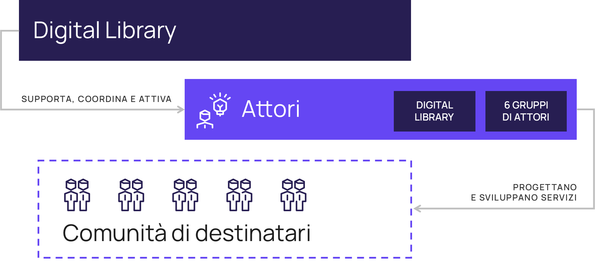
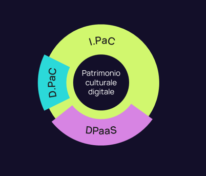
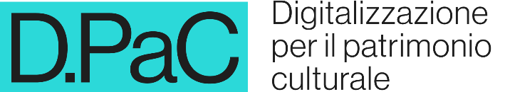
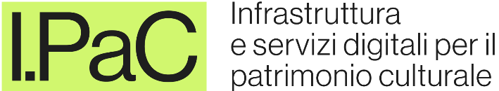
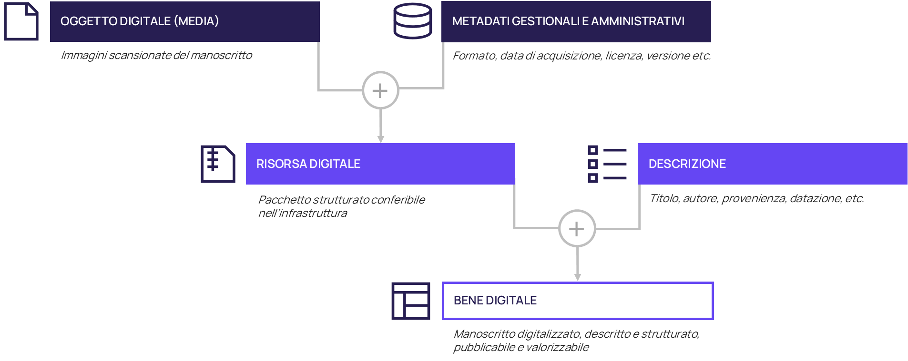
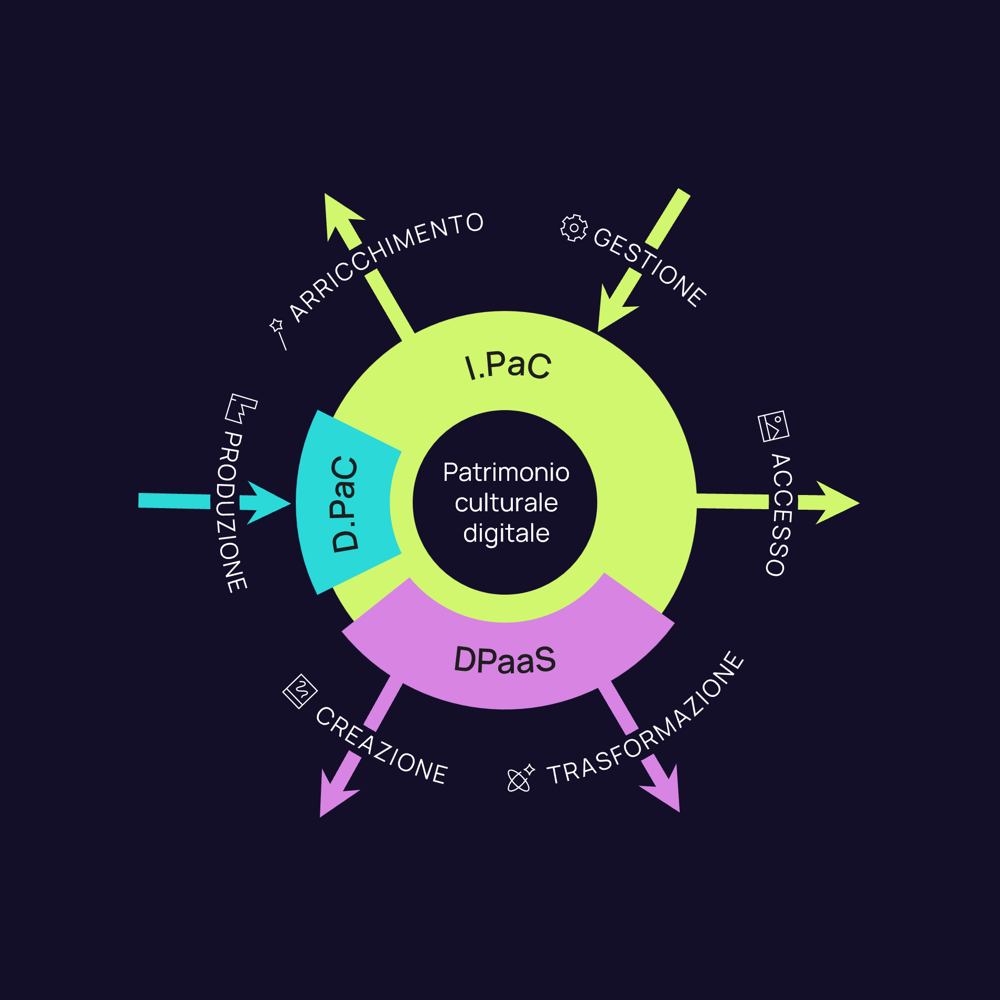
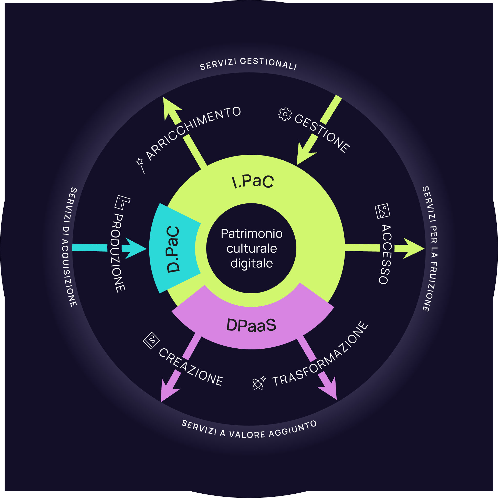
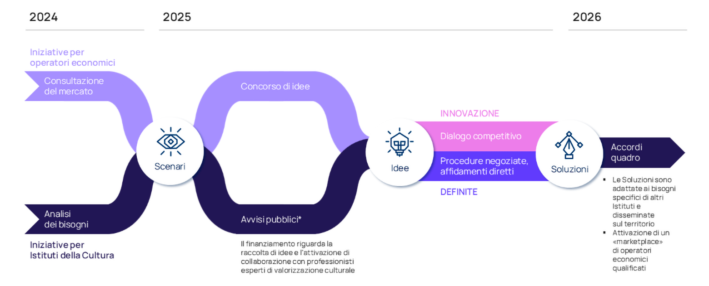
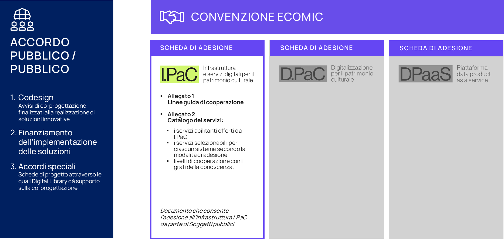

Ecomic, ecosistema digitale per la cultura
===========================================

Dopo l’inquadramento strategico, questo capitolo approfondisce 
la configurazione operativa di Ecomic, a partire dalla relativa definizione, dall’articolazione dei soggetti coinvolti e delle logiche di funzionamento. 
La strategia dell’ecosistema è attuata per mezzo di una struttura a regia distribuita. Digital Library promuove e coordina le iniziative degli Attori 
che contribuiscono con soluzioni digitali e servizi rivolti ai Destinatari.

Al centro della trattazione di Ecomic si colloca il nucleo tecnologico composto dai sistemi D.PaC, I.PaC e DPaaS, che abilitano la gestione integrata dei beni digitali in tutte le fasi del loro ciclo di vita. Il capitolo introduce inoltre le categorie di servizi digitali, abilitati o potenziati 
dal nucleo tecnologico, preparando l’analisi dettagliata che verrà svolta 
nei successivi capitoli 3 e 4.

Cos’è Ecomic?
-------------

Definizione
~~~~~~~~~~~
Ecomic – ecosistema digitale per la cultura è un ambiente collaborativo distribuito promosso dal Ministero della Cultura per sostenere la trasformazione digitale 
del settore culturale italiano. 

Si presenta come un ecosistema interoperabile, composto da una pluralità di sistemi, tecnologie 
e competenze che operano in modo coordinato per generare valore culturale, sociale ed economico. In questo contesto agiscono, in sinergia, enti titolari di beni culturali, istituzioni pubbliche, professionisti, centri di ricerca, imprese culturali, tecnologiche e creative, e operatori della filiera turistica. Al centro di Ecomic si trova un nucleo tecnologico che mette a disposizione servizi avanzati a supporto dell’intero ciclo di vita del bene digitale, dei relativi metadati 
e delle descrizioni. Tali servizi si rivolgono a designer di servizi, gestori e operatori della cultura 
che realizzano e adottano soluzioni digitali rivolte a cittadini, ricercatori, studiosi, professionisti, educatori e altri soggetti interessati a esplorare, fruire, riutilizzare o contribuire attivamente 
al patrimonio culturale digitale. La struttura modulare e interoperabile di Ecomic consente di attivare percorsi condivisi di innovazione, favorendo la co-specializzazione tra soggetti pubblici 
e privati e sostenendo la costruzione di una governance distribuita del patrimonio culturale digitale, in linea con le traiettorie di trasformazione delineate nel PND.

Definizione sintetica
~~~~~~~~~~~~~~~~~~~~~
Ecomic – ecosistema digitale per la cultura è un ambiente collaborativo distribuito promosso dal Ministero della Cultura per sostenere la trasformazione digitale 
del settore culturale. 

Fornisce modelli e strumenti – tecnologie, servizi, competenze – agli Attori dell’ecosistema 
per realizzare o potenziare servizi digitali rivolti ai Destinatari, con l’obiettivo di generare valore culturale, sociale ed economico.

Chi sono i protagonisti di Ecomic?
----------------------------------

Per comprendere il funzionamento di Ecomic, è necessario individuarne i protagonisti, ossia 
i soggetti che interagiscono all’interno dell’ecosistema. In continuità con la mappatura 
dei portatori di interesse proposta nella sezione 1.5, questa sezione introduce una classificazione funzionale basata sui ruoli assunti all’interno dell’ecosistema: 

- Digital Library, in quanto struttura delegata al processo di coordinamento dell’investimento M1C3 1.1, si occupa dell’implementazione e della gestione di Ecomic, offrendo supporto e coordinando gli Attori; 
- gli Attori​, che gestiscono beni digitali e progettano prodotti e servizi basati su tali risorse; 
- i Destinatari, che beneficiano dei prodotti e servizi.

Figura 2 | Chi sono i protagonisti di Ecomic?

Ruolo di Digital Library
~~~~~~~~~~~~~~~~~~~~~~~~

Digital Library guida e accompagna lo sviluppo di Ecomic, attraverso un’attività 
di coordinamento strategico che integra tecnologie, competenze, processi 
e modelli organizzativi. 

La guida esercitata da Digital Library può essere assimilata a quella che, nel mondo cinematografico, viene definita “regia all’americana”, dove il regista ha responsabilità 
di coordinamento, più che di produzione e scrittura diretta, e sovraintende un gruppo 
di professionisti che coinvolge produttori, sceneggiatori e studi cinematografici. 

Allo stesso modo, Digital Library guida lo sviluppo di Ecomic integrando tecnologie, competenze, processi e metodologie organizzative, senza accentrare le attività, ma valorizzando il contributo distribuito degli Attori coinvolti. Questa forma di regia distribuita, che coniuga indirizzo strategico e valorizzazione della pluralità di competenze, si traduce anche in un impegno nel fornire consulenza e soluzioni per attivare pratiche di open innovation, oltre a strumenti per 
la facilitazione delle attività amministrative di approvvigionamento (public procurement).

Per rispondere alle sfide della trasformazione digitale, Digital Library non si limita a sviluppare 
e gestire le infrastrutture e i servizi del nucleo tecnologico di Ecomic, bensì supporta gli Attori della trasformazione digitale attraverso azioni e soluzioni concrete: 

- Promuove la co-progettazione di soluzioni digitali;
- Fornisce linee guida, profili applicativi e metodologie organizzative;
- Offre consulenza specialistica e supporto tecnico;
- Incentiva la diffusione delle competenze digitali. 

Un ambito cruciale dell’azione di Digital Library è il supporto ai processi di procurement 
per l’innovazione, attraverso strumenti che facilitano l’incontro tra domanda pubblica e offerta di soluzioni digitali avanzate per la cultura. Questo impegno si traduce nella promozione 
di contesti collaborativi orientati alla co-progettazione, in cui soggetti diversi mettono in comune competenze complementari secondo un approccio di co-specializzazione. 

Questo approccio implica anche un ripensamento dei modelli organizzativi e delle modalità 
di cooperazione tra istituzioni, imprese e professionisti: Digital Library incoraggia la transizione verso una governance distribuita del settore, in cui la responsabilità del cambiamento rappresenta una sfida condivisa e l’innovazione si costruisce in modo collaborativo e sostenibile.

Attori
~~~~~~

Gli Attori sono i soggetti pubblici e privati che, sfruttando le infrastrutture 
e le opportunità abilitate dal nucleo tecnologico, progettano, sviluppano e gestiscono servizi digitali per la cultura.

Tra questi: enti pubblici e privati titolari di beni culturali, enti regionali, nazionali e internazionali che si occupano di governance in ambito culturale, professionisti della valorizzazione culturale, Università e Istituti di ricerca, imprese culturali, tecnologiche e creative, imprese della filiera turistica e di altri settori economici. Gli Attori possono interagire con Ecomic in modalità differenziate, operando in autonomia oppure avvalendosi del supporto offerto da Digital Library 
e da altri Attori. In questo contesto, è rilevante l’opportunità offerta da Ecomic di collaborare integrando le competenze per realizzare soluzioni innovative e scalabili, anche attraverso percorsi condivisi di procurement per l’innovazione promossi da Digital Library.

In questo quadro, gli Attori svolgono un duplice ruolo: fruitori dei servizi abilitanti offerti dal nucleo tecnologico, e al tempo stesso produttori di servizi digitali rivolti ai Destinatari dell’ecosistema. Contribuiscono così, in modo interdipendente, alla costruzione di una nuova governance distribuita del settore culturale.

Destinatari
~~~~~~~~~~~

I Destinatari di Ecomic sono i pubblici a cui sono rivolti i servizi digitali progettati 
dagli Attori dell’ecosistema.

Quest’ampia platea comprende cittadini, visitatori, ricercatori, studenti, educatori, professionisti, turisti e altri soggetti che interagiscono con il patrimonio culturale digitale. Sono accomunati dall’uso dei beni digitali – tramite accesso, utilizzo o riuso - grazie ai prodotti e servizi sviluppati dagli Attori. Nell’ecosistema, i Destinatari non sono semplici utenti finali, ma elementi centrali del processo di valorizzazione culturale, coinvolti sempre più spesso in dinamiche di 
co-creazione, partecipazione e costruzione di nuove esperienze digitali. Attraverso l’azione congiunta degli Attori e il coordinamento strategico esercitato da Digital Library, Ecomic 
è progettato per promuovere accessibilità, inclusività e rilevanza sociale dei servizi digitali, mettendo i Destinatari in condizione di accedere a contenuti culturali di qualità e personalizzati, che vengono attivati all’interno di processi e modelli di gestione in grado di generare nuovo valore.

Com’è costruito Ecomic?
-----------------------

Nucleo tecnologico di Ecomic
~~~~~~~~~~~~~~~~~~~~~~~~~~~~

Al centro dell’ecosistema si trova un nucleo tecnologico che fornisce servizi digitali abilitanti. 
Questa sezione ne introduce i tre sistemi abilitanti: D.PaC, I.PaC e DPaaS.

**D.PaC** è la piattaforma che supporta in modo strutturato ed efficiente la gestione, il monitoraggio e il controllo delle campagne di digitalizzazione dei beni culturali.

**I.PaC** è l'infrastruttura centrale di Ecomic che integra il patrimonio culturale digitale e ne rende possibile la gestione avanzata e la piena valorizzazione.

**DPaaS** è lo spazio di sperimentazione e innovazione di Ecomic. Si tratta di una piattaforma-laboratorio pensata per sviluppare nuovi prodotti e servizi digitali basati sui dati culturali.

D.PaC – Digitalizzazione per il patrimonio culturale
~~~~~~~~~~~~~~~~~~~~~~~~~~~~~~~~~~~~~~~~~~~~~~~~~~~~

   
D.PaC è la piattaforma che supporta in modo strutturato ed efficiente la gestione, 
il monitoraggio e il controllo delle campagne di digitalizzazione dei beni culturali. 

Progettata per rispondere agli obiettivi di digitalizzazione fissati nel PNRR, D.PaC consente 
di pianificare e gestire tutte le fasi del processo di digitalizzazione: dalla definizione delle attività 
e delle risorse necessarie, alla descrizione dei beni, al caricamento delle risorse digitali e al controllo della loro qualità.

Attraverso un’interfaccia web accessibile, D.PaC aiuta le amministrazioni committenti, gli Istituti titolari di beni culturali e i fornitori di servizi a collaborare nella realizzazione di progetti di digitalizzazione condivisi. La piattaforma integra strumenti per monitorare l’avanzamento dei progetti, garantire il rispetto degli standard nazionali e facilitare l’interoperabilità con gli altri sistemi abilitanti dell’ecosistema, in particolare I.PaC. D.PaC non è solo uno strumento tecnico, ma un abilitatore organizzativo, che promuove la standardizzazione dei processi, riduce i costi operativi e contribuisce alla qualità delle risorse digitali prodotte, rafforzando le competenze degli operatori coinvolti.

I.PaC – Infrastruttura e servizi digitali per il patrimonio culturale
~~~~~~~~~~~~~~~~~~~~~~~~~~~~~~~~~~~~~~~~~~~~~~~~~~~~~~~~~~~~~~~~~~~~~~

I.PaC è l’infrastruttura centrale di Ecomic che integra il patrimonio culturale digitale 
e ne rende possibile la gestione avanzata e la piena valorizzazione. 

È progettata per offrire servizi digitali per mezzo della cooperazione applicativa tra sistemi informatici e tra enti, costituendo il cuore tecnologico e informativo dell’ecosistema. 

Non si rivolge direttamente ai Destinatari finali, ma è progettata per essere utilizzata dai sistemi degli Attori dell’ecosistema. Enti culturali e istituzioni possono aderire a I.PaC per usufruire di funzionalità avanzate, messe a disposizione attraverso servizi web e API. La logica è quella del “M2M” (*machine-to-machine*): I.PaC opera come motore “invisibile” che alimenta l’ecosistema con dati interoperabili, connessi e arricchiti, pronti per essere utilizzati in portali, app, piattaforme e servizi digitali. Attraverso tecnologie semantiche, grafi di conoscenza e strumenti di *content processing*, I.PaC consente di organizzare e arricchire i dati culturali provenienti da ambiti diversi, consentendone il riuso per molteplici finalità. I.PaC è accessibile ai sistemi aderenti 
per mezzo di tre diversi modelli di cooperazione, tutti basati sulla tecnologia cloud: 

- Integrazione: prevede il conferimento diretto a I.PaC sia delle risorse digitali 
che delle descrizioni;
- Federazione: consente la gestione autonoma delle risorse digitali da parte 
del sistema aderente; con I.PaC sono condivisi solo i dati descrittivi;
- Conferimento: rivolto principalmente a istituzioni prive di infrastrutture proprie, consente di caricare in I.PaC risorse digitali e descrizioni utilizzando piattaforme 
o sistemi terzi. Questo modello, adatto per progetti mirati o temporanei, permette 
agli enti di beneficiare dei servizi avanzati di elaborazione e valorizzazione offerti 
da I.PaC, come l’inserimento nel grafo di conoscenza, facilitando la fruizione 
del patrimonio tramite altri canali digitali.

DPaaS – Piattaforma data product as a service
~~~~~~~~~~~~~~~~~~~~~~~~~~~~~~~~~~~~~~~~~~~~~

DPaaS è lo spazio di sperimentazione e innovazione di Ecomic. 
Si tratta di una piattaforma-laboratorio pensata per sviluppare nuovi prodotti 
e servizi digitali basati sui dati culturali. 

DPaaS mette a disposizione strumenti avanzati, spazio computazionale 
e accesso ai dati utili allo sviluppo e all’implementazione di nuove soluzioni per il mondo 
della cultura. È rivolta a imprese culturali, creative e tecnologiche, sviluppatori, Istituti di ricerca 
e soggetti pubblici interessati a realizzare nuove forme di valorizzazione del patrimonio digitale.

Attraverso DPaaS i beni digitali – siano essi prodotti tramite D.PaC e ospitati e gestiti da I.PaC, 
o provenienti direttamente da enti culturali attraverso propri sistemi informativi cooperanti – possono essere trasformati in esperienze digitali personalizzate, strumenti educativi, percorsi turistici intelligenti, applicazioni interattive o contenuti per la ricerca.

DPaaS rappresenta il punto d’incontro tra patrimonio e creatività, tra dati e servizi, tra pubblico 
e privato. È l’ambiente dell’ecosistema dedicata alla valorizzazione attiva dei dati culturali, orientata allo sviluppo sociale, culturale ed economico del settore.

Sperimentazione e Intelligenza Artificiale
~~~~~~~~~~~~~~~~~~~~~~~~~~~~~~~~~~~~~~~~~~

L’intelligenza artificiale (IA) rappresenta una leva potente per trasformare il patrimonio culturale digitale in una risorsa viva, interrogabile e attivabile. L’IA non si limita a velocizzare operazioni o automatizzare processi: consente di estrarre conoscenza dai dati, di rendere accessibili contenuti complessi, di guidare nuovi modi di esplorare il patrimonio culturale. 
È per questo che Ecomic le assegna un ruolo centrale e trasversale.  

Lo sviluppo del nucleo tecnologico di Ecomic ha beneficiato di un’intensa attività di sperimentazione volta a esplorare le potenzialità dell’IA nella gestione e nella valorizzazione 
del patrimonio culturale digitale con l’obiettivo di renderla un’infrastruttura cognitiva pubblica, affidabile e sostenibile, al servizio dell’intero ecosistema. 

Tale attività si è concentrata, in prima istanza, sulla categoria “*BitStream*”, che comprende 
le operazioni che trasformano gli oggetti digitali (es. testi scansionati, immagini, mappe, audio, video) in contenuti leggibili, indicizzabili e utilizzabili dai sistemi informatici. Elemento cardine 
di questo primo asse sperimentale è lo sviluppo di 34 componenti software elementari 
(primitive) che possono essere combinati per costruire flussi di lavoro automatizzati complessi, adattabili a diversi tipi di contenuti e contesti. I casi d’uso sviluppati da queste 
primitive hanno un impatto diretto sull’accessibilità dei beni digitali: rendono utilizzabili e riusabili gli oggetti digitali grezzi, facendo emergere entità e relazioni altrimenti inaccessibili. 
Ne sono esempi il riconoscimento del testo da immagini (OCR), la trascrizione automatica di file audio o video, la generazione di abstract e indici, la conversione di testi in voce. 

La seconda categoria di funzionalità sperimentate, “*DataStream*” , lavora invece al livello semantico dei beni digitali: le risorse digitali vengono curate e contestualizzate, rendendole non solo accessibili ma anche strutturate, connesse e interrogabili, supportando nuove forme 
di ricerca, narrazione e fruizione. Rientrano in questa categoria le operazioni di clusterizzazione 
di entità simili, di riconciliazione con authority file e vocabolari controllati, di bonifica testuale 
e strutturale, di arricchimento dei profili descrittivi. Queste funzionalità rappresentano 
un supporto significativo al lavoro dei catalogatori, capace di guidarli efficacemente sia 
nella revisione di descrizioni esistenti sia nella creazione di nuove descrizioni.

Infine, l’introduzione di agenti conversazionali rappresenta una terza area sperimentale, destinata a incidere profondamente sulla modalità con cui il pubblico e gli operatori interagiranno con il patrimonio. Questi strumenti, basati su modelli linguistici addestrati per l’interfaccia dialogica, non utilizzano tecniche di generazione autonoma del contenuto (IA generativa), 
ma si basano su un’architettura di “retrieval-augmented generation” (RAG): le risposte fornite 
agli utenti derivano direttamente dalla conoscenza strutturata presente nel grafo semantico. Grazie a questo approccio, gli agenti sono in grado di recuperare e presentare contenuti attendibili e verificabili, navigando in modo intelligente tra metadati, relazioni e oggetti. 

Nel suo complesso, la sperimentazione condotta da Digital Library assume un ruolo pionieristico, dimostrando la fattibilità e la maturità dell'intelligenza artificiale applicata al ciclo di vita del bene digitale e offrendo una base tecnologica solida per l’intero ecosistema: le soluzioni testate, adattate e consolidate in fase sperimentale sono oggi pronte per essere rese disponibili su scala nazionale attraverso i servizi e gli ambienti del nucleo tecnologico di Ecomic.

L’IA, in questo quadro, non è solo un insieme di strumenti, ma una leva trasformativa 
che ridisegna le possibilità di accesso alla conoscenza culturale, secondo principi 
di inclusività, sostenibilità e interoperabilità semantica.

A che cosa serve Ecomic?
------------------------

Ecomic è un ambiente collaborativo distribuito finalizzato alla valorizzazione del patrimonio culturale digitale. Grazie a un insieme integrato di tecnologie avanzate e servizi operativi, consente di trasformare i dati del patrimonio in beni digitali fruibili e arricchiti, favorendo così 
la generazione di nuovi servizi e prodotti e nuove modalità di accesso al patrimonio.

Ecomic sostiene efficacemente ogni fase del ciclo di vita dei beni digitali, dall’acquisizione iniziale fino alla gestione, conservazione e riuso, integrando queste fasi all’interno di una filiera strutturata e coerente. L’infrastrutturazione e l’industrializzazione di questi processi permettono di creare valore a partire dai beni digitali, abilitando la creazione di prodotti e servizi 
a beneficio dell’intero ecosistema culturale. 

Prima di procedere con una definizione puntuale delle fasi del ciclo di vita del bene digitale, 
se ne definiscono di seguito i suoi elementi costitutivi: descrizione e risorsa digitale.

Risorsa digitale
~~~~~~~~~~~~~~~~

Una risorsa digitale è un’entità digitale composta da uno o più oggetti digitali 
(o media) e da una componente informativa, formata da metadati amministrativi 
e gestionali.

La risorsa digitale può essere creata nativamente in digitale – per esempio, una video-intervista, un sito web – o derivare dalla conversione di materiali analogici – per esempio, 
una scansione di un manoscritto su carta – e assume significato e valore nel contesto in cui 
è ospitata e descritta. Nel contesto di sistemi digitali strutturati (quali biblioteche e archivi digitali, *repository* complessi), la risorsa digitale è anche un’entità logica e fisica, utilizzata per aggregare e gestire oggetti digitali legati a uno o più record informativi, secondo logiche gerarchiche (contenitori, sotto-contenitori, collezioni, cartelle *smart*). 

Può inoltre assumere una valenza semantica, se descritta in modo da renderla rintracciabile, interrogabile e interoperabile in base al significato che assume in uno specifico dominio 
della conoscenza.

All’interno del ciclo di vita del patrimonio culturale digitale, la risorsa digitale non è un semplice corredo informativo, ma un elemento abilitante e autonomo per l’accesso, la valorizzazione 
e la contestualizzazione dei contenuti culturali in ambiente digitale.

Esempio: Un manoscritto del XV secolo conservato presso una biblioteca storica 
è sottoposto a digitalizzazione ad alta risoluzione. Il risultato di questa operazione è una serie di immagini (es. formato TIFF) di ciascuna pagina del documento. 
Le immagini diventano risorsa digitale solo quando sono strutturate e aggregate secondo 
un profilo applicativo (es. METS ECO-MiC), corredate da metadati gestionali e amministrativi che ne descrivono la provenienza, la modalità di digitalizzazione, i diritti di utilizzo, le condizioni tecniche, ecc., e conferite all’interno di un’infrastruttura digitale in grado di interpretarli 
e gestirli correttamente.

Descrizione
~~~~~~~~~~~

La descrizione è un dispositivo informativo che documenta l’identità di un oggetto fisico o concettuale e ne esplicita le relazioni significative in un ambiente digitale attraverso un insieme strutturato di metadati descrittivi. Costituisce, in altre parole, 
una rappresentazione dell’oggetto e del suo contesto di senso.

Attraverso la descrizione, l’oggetto fisico o concettuale è reso accessibile, interrogabile e interoperabile, assumendo una forma computabile che ne permette l’arricchimento anche automatico. Svolge un ruolo fondamentale per abilitare percorsi di conoscenza, fruizione e riuso.

La descrizione può essere considerata un contenuto autoriale a sé stante, anche separabile dall’oggetto a cui si riferisce e avere pertanto un proprio ciclo di vita indipendente. 

Esempio: Un manoscritto miniato del XV secolo conservato presso una biblioteca storica 
è stato oggetto di catalogazione da parte di un operatore esperto, che ne ha redatto una scheda descrittiva secondo le regole e gli standard della descrizione bibliografica e documentaria. Questa scheda contiene informazioni testuali e semantiche, come titolo, autore, datazione, luogo di produzione, lingua del testo, tecnica di esecuzione, descrizione 
del contenuto, contesto di provenienza. Tutto ciò costituisce un reticolo informativo che identifica il manoscritto e lo collega ad altre opere, contesti, periodi storici, domini culturali. Anche in assenza di una riproduzione digitale del manoscritto, la descrizione, formalizzata all’interno di un record informativo, attribuisce significato al bene culturale.

Bene digitale
~~~~~~~~~~~~~

Il bene digitale è l’unità informativa completa che deriva dall’integrazione sinergica 
tra la descrizione e la risorsa digitale.

La descrizione, grazie alla sua natura informativa, può esistere in ambiente digitale anche 
in assenza di una corrispondente risorsa digitale. Si presenta come elemento autonomo capace di mantenere traccia di un bene, fornendo le chiavi per comprenderlo e contestualizzarlo anche se non ancora o solo parzialmente digitalizzato. Quando associata a una risorsa digitale, 
la descrizione abilita la ricostruzione del significato e del contesto.

La risorsa digitale, a sua volta, è l’entità che aggrega e struttura uno o più oggetti digitali. All'interno di sistemi digitali strutturati si organizza funzionalmente per facilitare l'accesso diretto alla rappresentazione digitale di un bene (gemello digitale). Tuttavia, la risorsa digitale acquisisce pieno significato e operatività solamente quando è associata a una descrizione accurata, che ne espliciti le proprietà, le relazioni e la collocazione semantica nel sistema. 

Il bene digitale, pertanto, nasce da questa integrazione sinergica: è una risorsa digitale dotata 
di descrizione e quindi capace di generare significato e partecipare ai processi di fruizione e valorizzazione. La sua efficacia dipende non solo dalla presenza di dati e oggetti digitali, ma soprattutto dalla loro inseribilità in un contesto logico, documentale e semantico coerente. 

Il bene digitale costituisce l’elemento centrale dei processi del ciclo di vita del patrimonio digitale – dalla produzione al riuso – ed è il perno attorno al quale si articolano i servizi digitali per la conservazione, la gestione, l’accesso e la valorizzazione del patrimonio.

Esempio: Il manoscritto miniato del XV secolo, dopo essere stato digitalizzato, strutturato 
e descritto, diventa un bene digitale pienamente attivo. Le immagini che ne documentano ogni pagina sono state raccolte in una risorsa digitale strutturata secondo il profilo METS ECO-MiC, validata e conferita all’interno dell’infrastruttura. 
A questa risorsa è stata associata una descrizione semantica, conforme agli standard 
di metadatazione descrittiva, che ne specifica contenuti, autorialità, datazione, soggetti 
e relazioni. Il manoscritto può ora essere ricercato e interrogato tramite parole chiave, date, nomi di persona o luogo; navigato digitalmente attraverso la sequenza delle sue immagini, organizzate per sezioni liturgiche o miniature significative; collegato ad altri manoscritti simili per autore, provenienza o iconografia; esplorato anche da utenti con disabilità grazie 
a strumenti accessibili; riutilizzato in percorsi didattici, progetti creativi, applicazioni narrative. 
Il bene digitale, così inteso, è una entità patrimoniale informativa e attivabile, in cui contenuto digitale, struttura logica, metadati descrittivi e funzionalità tecniche convivono in modo coerente e interoperabile. È l’unità base su cui si innestano i servizi dell’ecosistema: 
dalla gestione alla conservazione, dall’accesso alla valorizzazione.

Figura 3 | Cos’è un bene digitale?

Ciclo di vita del bene digitale
~~~~~~~~~~~~~~~~~~~~~~~~~~~~~~~

Il ciclo di vita del bene digitale descrive l’insieme dei processi che ne accompagnano la creazione, la gestione e l’attivazione in servizi e prodotti digitali. Ogni fase è supportata dai servizi abilitanti del nucleo tecnologico di Ecomic e contribuisce alla generazione di valore culturale, sociale ed economico per l’intero ecosistema. 

Produzione
~~~~~~~~~~

La produzione comprende l’acquisizione di nuovi beni digitali (ivi comprese descrizioni e metadati) tramite digitalizzazione o creazione nativa e il conferimento 
di risorse digitali e descrizioni preesistenti. Il processo di produzione è alla base 
della digitalizzazione del patrimonio culturale ed è il punto di partenza per il corretto funzionamento delle piattaforme di gestione e fruizione dei dati, le cui potenzialità crescono in proporzione alla quantità e alla qualità di beni digitali disponibili. In Ecomic, D.PaC svolge un ruolo chiave per la produzione di nuovi beni digitali garantendone piena affidabilità e aderenza 
agli standard qualitativi e ai principi FAIR.

Arricchimento
~~~~~~~~~~~~~

L’arricchimento riguarda i processi di elaborazione semantica e strutturale dei beni digitali, che Ecomic rende possibile automatizzare e potenziare grazie a servizi avanzati come il riconoscimento ottico dei caratteri (OCR/ICR) l’estrazione automatica di entità (NER), la normalizzazione e la modellazione dei dati. 
I grafi della conoscenza generati da I.PaC mettono in relazione risorse provenienti da domini culturali diversi, costituendo una base informativa unica. Questa fase abilita la piena valorizzazione culturale dei dati, la fruizione intelligente e contestualizzata e nuove possibilità 
di riuso creativo ed economico.

Gestione
~~~~~~~~

La gestione comprende le operazioni di modifica, aggiornamento e cancellazione delle risorse digitali e delle descrizioni da parte dei sistemi cooperanti con I.PaC. Questa fase garantisce l'interoperabilità e la qualità semantica dei beni digitali 
nel tempo, contribuendo a una loro valorizzazione solida e continuativa, sia in ambito istituzionale che per usi estesi, favorendo efficienza operativa e sostenibilità gestionale.

Accesso
~~~~~~~

L’accesso consiste nei processi di esplorazione, ricerca e consultazione dei beni digitali. I.PaC, con i suoi servizi *Data as a Service (DaaS)* e *Knowledge as a Service (KaaS)* basati su profili applicativi ontologici studiati per ciascun dominio della descrizione, consente la costruzione di veri e propri “paesaggi culturali” dinamici 
e personalizzabili. Questa fase abilita una fruizione pubblica ampia, inclusiva e personalizzata, aprendo nuove strade alla partecipazione sociale e alla valorizzazione del patrimonio culturale.

Trasformazione
~~~~~~~~~~~~~~

La trasformazione comprende i processi di rielaborazione e conversione dei beni digitali per finalità specifiche: ricerca scientifica, interoperabilità tra *dataset*, riuso per finalità commerciali e non commerciali, creazione di diversi oggetti digitali (*rendition*) della stessa risorsa (es. adattamenti per target, formati, contesti). Abilita la circolazione 
e la contaminazione dei contenuti, favorendo la produzione di conoscenza, l’innovazione 
di processo e nuove forme di valorizzazione economica e culturale.

Creazione
~~~~~~~~~

La creazione è la fase in cui, a partire dai beni digitali già disponibili, la piattaforma DPaaS consente di generare nuovi contenuti, prodotti e servizi digitali, attraverso processi di rielaborazione, reinterpretazione e progettazione. Tale processo comprende due dimensioni complementari:

- La creazione di nuovi beni digitali derivati, che arricchiscono il patrimonio informativo esistente con nuove elaborazioni, versioni o rappresentazioni dei contenuti originali;
- Lo sviluppo di prodotti e servizi digitali innovativi, basati sui dati culturali per 
i Destinatari, come percorsi educativi, narrazioni interattive, mostre virtuali, applicazioni, soluzioni per la fruizione aumentata o strumenti editoriali e commerciali.

La creazione è il fulcro della valorizzazione orientata all’utente: trasforma i dati in esperienze accessibili e significative, genera valore culturale, economico e sociale, stimola inclusione 
e partecipazione, sostiene l’industria creativa e lo sviluppo delle competenze digitali.

Come funziona Ecomic?
---------------------

Gli Attori dell’ecosistema sfruttano i servizi abilitanti di Ecomic per creare o potenziare le soluzioni digitali rivolte ai propri Destinatari. Questa sezione presenta le principali categorie di sistemi sviluppati dagli Attori e descrive come essi contribuiscano alla diffusione, alla fruizione 
e alla valorizzazione del patrimonio digitale. 

I servizi rivolti ai Destinatari che sono abilitati o potenziati da Ecomic sono definiti in continuità con la classificazione proposta dal PND:

- Servizi per la fruizione;
- Servizi gestionali;
- Servizi a valore aggiunto;
- Servizi per l’acquisizione

Servizi per la fruizione
~~~~~~~~~~~~~~~~~~~~~~~~

I servizi per l’accesso e la fruizione sono progettati per offrire ai Destinatari — cittadini, ricercatori, studenti, professionisti — strumenti digitali per esplorare, consultare e comprendere 
il patrimonio culturale digitale. Questi servizi sono l’espressione della valorizzazione promossa da Ecomic: beni digitali accessibili, inclusivi e attivabili nei contesti sociali, educativi, civici e creativi.

Grazie ai servizi del nucleo tecnologico, queste piattaforme possono offrire esperienze 
di fruizione intelligenti e multidimensionali, basate su modelli semantici condivisi e su una forte integrazione tra contenuti, metadati e funzionalità. 

Rientrano in questa categoria: portali e applicazioni di accesso al patrimonio a livello nazionale (es. Catalogo generale dei beni culturali dell’ICCD), territoriale, tematico; sistemi di navigazione semantica; visualizzatori avanzati; mappe tematiche 
e interattive; interfacce conversazionali; aggregatori culturali nazionali, regionali 
o internazionali (es. Europeana).

Piattaforma di accesso integrato
^^^^^^^^^^^^^^^^^^^^^^^^^^^^^^^^

Tra i sistemi per l’accesso e la fruizione assume particolare rilevanza la Piattaforma di accesso integrato, sviluppata da Digital Library nell’ambito del sub-investimento M1C3 1.1.10.

Concepita come uno dei principali punti di accesso pubblico al patrimonio culturale digitale, 
la Piattaforma rappresenta una delle espressioni più visibili di Ecomic: la Piattaforma integra e valorizza i beni digitali ospitati in I.PaC, restituendoli in un’interfaccia unificata, interoperabile 
e orientata all’esperienza utente. 

La Piattaforma è progettata per aggregare, esplorare e rendere riutilizzabili le risorse digitali 
del patrimonio culturale, grazie al supporto dei servizi abilitanti offerti da I.PaC e DPaaS.

Attraverso funzionalità di ricerca avanzata, navigazione semantica e visualizzazione interattiva, 
la piattaforma consente a cittadini, studenti, turisti, educatori e professionisti del settore 
di esplorare i contenuti, ottenere copie digitali e creare percorsi tematici, narrazioni e mappe personalizzate.

Servizi gestionali
~~~~~~~~~~~~~~~~~~

I servizi gestionali sono dedicati alla organizzazione, conservazione e amministrazione dei beni digitali lungo l’intero ciclo di vita informativo e operativo. Sono fondamentali per garantire 
la qualità, la rintracciabilità e la disponibilità nel tempo dei beni digitali. Questi servizi non sono rivolti direttamente ai Destinatari, ma permettono a istituzioni culturali, enti pubblici e operatori professionali coinvolti nella gestione del patrimonio digitale di operare sui propri beni digitali.

Questi servizi contribuiscono in modo determinante agli obiettivi di interoperabilità e di abilitazione di Ecomic: consentono di mantenere un patrimonio digitale aggiornato, coerente 
e integrabile nel tempo, secondo standard condivisi e pratiche sostenibili. 

Rientrano in questa categoria: sistemi informativi di gestione del patrimonio digitale (es. archivi digitali, *library management systems*); sistemi per la conservazione digitale a norma; ambienti per il versionamento e l’editing; strumenti per la validazione, la normalizzazione e la pubblicazione.

Servizi a valore aggiunto
~~~~~~~~~~~~~~~~~~~~~~~~~

I servizi a valore aggiunto comprendono interventi creativi, educativi, espositivi e commerciali che utilizzano i beni digitali per generare nuovi prodotti, esperienze o conoscenze. Si tratta di servizi orientati alla trasformazione del patrimonio digitale in valore, anche attraverso forme ibride che coniugano ricerca, mediazione culturale, tecnologie immersive e strumenti di partecipazione. Sono spesso realizzati in collaborazione con imprese culturali, tecnologiche e creative, 
e rappresentano un ambito strategico per la valorizzazione economica e sociale del patrimonio.

L’obiettivo di Ecomic in questo ambito è duplice: da un lato, valorizzare il patrimonio in chiave esperienziale e generativa, dall’altro, abilitare nuovi modelli di collaborazione pubblico-privato 
per l’innovazione nei servizi culturali. Attraverso DPaaS e i dati culturali strutturati, il nucleo tecnologico offre le basi per lo sviluppo sostenibile di questi servizi, in coerenza con gli obiettivi strategici dell’ecosistema.

Rientrano in questa categoria: strumenti di narrazione e *storytelling* interrativo; applicazioni XR per la visita immersiva; app per la creazione di percorsi personalizzati 
e contenuti adattivi; soluzioni per l’accessibilità aumentata (es. traduzioni LIS, audio descrizioni); ambienti per la co-creazione e il riuso partecipativo.

Servizi di acquisizione
~~~~~~~~~~~~~~~~~~~~~~~

I servizi di acquisizione ​ supportano la produzione di beni digitali (ivi compresi metadati e descrizioni), attraverso due modalità principali: la digitalizzazione di beni culturali e l’acquisizione di beni digitali nativi. Questi servizi consentono il popolamento dell’infrastruttura e dei diversi sistemi secondo standard tecnici e descrittivi, abilitando l’avvio del ciclo di vita del bene digitale.

Ecomic intende abilitare un’ampia platea di Attori alla produzione di beni digitali conformi, garantendo coerenza semantica, interoperabilità e riuso futuro sin dalla fase di acquisizione.

Rientrano in questa categoria: piattaforme software a supporto della digitalizzazione; strumenti per il collaudo e la *data-quality*; soluzioni per l’acquisizione avanzata (modelli 3D, digital twin e multispettrale); strumenti per la raccolta 
e l’acquisizione di contenuti nativi digitali; moduli di descrizione e catalogazione 
del patrimonio.

Come cresce e si sviluppa Ecomic?
---------------------------------

Ecomic si fonda su un’infrastruttura tecnologica avanzata e su un insieme articolato 
di competenze e strumenti di natura organizzativa che ne sostengono la crescita, l’adozione 
e l’evoluzione.

Digital Library promuove un accompagnamento strutturato e continuativo, finalizzato a garantire coerenza strategica, interoperabilità, crescita delle competenze, innovazione sostenibile 
e governance partecipata.

Strategia per l’innovazione 2024-2026
~~~~~~~~~~~~~~~~~~~~~~~~~~~~~~~~~~~~~

La strategia di innovazione promossa da Digital Library prende avvio da un'estesa attività 
di ascolto e mappatura dei fabbisogni del settore culturale, realizzata attraverso consultazioni, analisi di mercato e momenti di confronto con gli stakeholder. Fin dal 2022, l’iniziativa nazionale 
“Il PND in viaggio” e numerosi incontri territoriali hanno coinvolto Istituti culturali, imprese, professionisti e università, consentendo di raccogliere esigenze progettuali concrete, organizzabili per scenari d’uso, tipologia di ente e grado di maturità digitale.

Questa base conoscitiva ha orientato la definizione di una strategia di innovazione per il triennio 2024–2026, fondata sull’impiego sistematico del procurement pubblico come leva di attuazione. 
Il procurement consente di attivare meccanismi strutturati di incontro tra la domanda di innovazione espressa dal sistema culturale e la capacità operativa del mercato e della ricerca. 
La strategia copre l’intero ciclo dell’innovazione: dalla rilevazione dei bisogni, alla selezione delle soluzioni, fino alla sperimentazione, implementazione e disseminazione scalabile. Digital Library non si limita alla conduzione amministrativa delle procedure (in collaborazione con Invitalia), il suo ruolo si esprime nella capacità di coordinare Attori eterogenei, valorizzarne le competenze complementari e generare un ambiente stabile di innovazione aperta e collaborativa.

Le azioni di procurement rappresentano, dunque, lo strumento privilegiato per tradurre 
la strategia in pratica, come illustrato nel dettaglio nel paragrafo successivo.

Strumenti di procurement per l’innovazione
~~~~~~~~~~~~~~~~~~~~~~~~~~~~~~~~~~~~~~~~~~

Avviso pubblico per il finanziamento di Istituti della cultura
^^^^^^^^^^^^^^^^^^^^^^^^^^^^^^^^^^^^^^^^^^^^^^^^^^^^^^^^^^^^^^

Nel 2024 Digital Library ha pubblicato quattro avvisi pubblici volti a selezionare proposte innovative da parte di Istituti e Luoghi della Cultura, con riferimento a quattro “Scenari d’uso” prioritizzati grazie all’attività di consultazione del mercato e analisi della domanda: accessibilità, *gamification*, fruizione avanzata del patrimonio, diagnostica e restauro.

Gli avvisi hanno avuto una duplice finalità: da un lato, incentivare lo studio di soluzioni digitali per la valorizzazione del patrimonio culturale proprio degli Istituti; dall’altro, individuare e sostenere 
il reclutamento di figure professionali altamente qualificate – con competenze digitali, creative, manageriali – in grado di accompagnare la progettazione e l’implementazione delle soluzioni proposte. Le oltre 240 candidature pervenute testimoniano l’ampiezza e l’urgenza della domanda di innovazione nel settore, confermando la bontà del modello aperto e partecipativo promosso da Digital Library.

Concorso di idee per gli operatori economici
^^^^^^^^^^^^^^^^^^^^^^^^^^^^^^^^^^^^^^^^^^^^

A integrazione dell’avviso rivolto agli Istituti culturali, Digital Library ha lanciato un concorso di idee per operatori culturali e tecnologici. Il concorso ha inteso raccogliere proposte progettuali innovative per la valorizzazione del patrimonio culturale, stimolando la creatività progettuale 
e intercettando soluzioni potenzialmente dirompenti. Questo ha consentito di raccogliere oltre 130 proposte progettuali, ispirandosi alle buone pratiche europee in materia di innovazione aperta e design thinking applicato alla PA e ha permesso di arricchire il portafoglio di idee da valorizzare nella fase successiva.

Dialogo Competitivo
^^^^^^^^^^^^^^^^^^^

La procedura rappresenta il cuore del modello di procurement innovativo sviluppato da Digital Library. Essa ha l’obiettivo di tradurre in prodotti digitali concreti almeno 24 idee selezionate tramite avvisi o concorsi, grazie a un confronto strutturato tra Amministrazione e operatori 
di mercato. Il dialogo consente di colmare il divario tra fabbisogni complessi e offerta di soluzioni tecnologiche, generando toolkit, data product e servizi digitali ad alto valore aggiunto, successivamente integrabili in Ecomic (e in particolare nella piattaforma DPaaS).

Grazie al principio di scalabilità, ogni soluzione progettata potrà essere riutilizzata e adattata 
in una pluralità di contesti, trasformando l’innovazione puntuale in valore sistemico, grazie anche al ruolo di Digital Library nel coordinamento dell’intero processo, nella prioritizzazione 
e nella messa a fattor comune delle numerose esigenze raccolte.

Procedure negoziate
^^^^^^^^^^^^^^^^^^^

Accanto al dialogo competitivo, Digital Library ha attivato procedure negoziate per l’acquisizione diretta di soluzioni innovative dalle caratteristiche tecniche già circoscritte. Questo strumento 
si è rivelato particolarmente efficace per progetti specifici ad alto contenuto tecnologico, 
come la produzione di dati “*linked open*” o la trascrizione automatizzata di epigrafi antiche. 
In questi casi, l’individuazione di soluzioni puntuali e l’ottimizzazione dei processi di acquisizione consentono una risposta tempestiva alle esigenze degli Istituti e una rapida integrazione 
delle soluzioni all’interno di Ecomic.

Disseminazione delle soluzioni e open innovation
^^^^^^^^^^^^^^^^^^^^^^^^^^^^^^^^^^^^^^^^^^^^^^^^

In coerenza con la visione di lungo periodo delineata nella strategia per l’innovazione, Digital Library prevede, a partire dal 2026, l’attivazione di strumenti stabili per favorire la disseminazione scalabile delle soluzioni sviluppate e l’aggregazione continua della domanda e dell’offerta 
di innovazione. Questi strumenti saranno progettati per rafforzare la co-progettazione tra pubblico e privato, incentivare il riuso, facilitare l’adattamento e sostenere la crescita del mercato digitale culturale.

Figura 4 | Strategia per l’innovazione 2024-2026

Linee guida tecniche
~~~~~~~~~~~~~~~~~~~~

Digital Library cura la definizione, l’adozione e l’aggiornamento di linee guida tecniche condivise per la produzione, descrizione e gestione dei contenuti digitali culturali. Queste linee guida includono formati, tracciati, standard e modelli di metadatazione conformi alle disposizioni del Piano Nazionale di Digitalizzazione (PND), come il profilo METS ECO-MiC, elaborato primariamente per garantire l’interoperabilità semantica delle risorse digitali in tutti i domini culturali. Sono inoltre recepite e implementate le indicazioni delle Linee guida per la digitalizzazione del patrimonio culturale, per la classificazione di prodotti e servizi digitali, per il riuso delle riproduzioni digitali 
e per la redazione del Piano di gestione dei dati. Particolare attenzione è riservata alla promozione di tecnologie *open source* e di standard *open data* al fine di garantire la massima accessibilità, trasparenza e riusabilità dei beni digitali nel tempo.

Linee guida metodologiche e gestionali
~~~~~~~~~~~~~~~~~~~~~~~~~~~~~~~~~~~~~~

A fianco delle prescrizioni tecniche, Digital Library promuove un insieme di linee guida metodologiche e gestionali che orientano l’organizzazione e il governo dei processi 
di digitalizzazione. Tra queste:

- Il Modello operativo di gestione, monitoraggio e controllo definisce flussi di lavoro, fasi di progetto e ruoli operativi per la gestione delle campagne di digitalizzazione, ingegnerizzati all’interno di D.PaC;
- Il Modello organizzativo per la co-specializzazione di Digital Library è volto 
a strutturare forme di collaborazione stabile tra soggetti con competenze complementari.

Queste linee guida promuovono un approccio ecosistemico fondato su processi e responsabilità chiare, rafforzando la capacità degli enti culturali di partecipare alla trasformazione digitale 
in modo coordinato, efficiente e replicabile.

Formazione
~~~~~~~~~~

La crescita delle competenze è condizione necessaria per la trasformazione digitale. Per questo Digital Library promuove azioni strutturate di formazione, aggiornamento e capacity building rivolte agli Attori dell’ecosistema. In questo contesto, il Dicolab offre percorsi formativi sulle tecnologie e metodologie alla base di Ecomic. Inoltre, la collaborazione con la Scuola Nazionale per il Patrimonio e le Attività culturali consente di integrare la formazione digitale nei programmi 
di aggiornamento per il personale degli Istituti culturali.

Ruolo dei Demand e Product Manager di Digital Library
~~~~~~~~~~~~~~~~~~~~~~~~~~~~~~~~~~~~~~~~~~~~~~~~~~~~~

Nel modello organizzativo di Digital Library, i Demand Manager garantiscono che l’evoluzione di Ecomic sia coerente con i bisogni degli Attori dell’ecosistema. Attraverso un dialogo strutturato con Istituti culturali, imprese, accademia e professionisti, queste figure supportano la raccolta e la prioritizzazione dei fabbisogni, traducendoli in traiettorie evolutive dei sistemi di Ecomic (D.PaC, I.PaC, DPaaS e la Piattaforma di accesso integrato).

I Product Manager presidiano la visione strategica dei prodotti e ne guidano lo sviluppo, mentre 
i Demand Manager si concentrano sull’analisi della domanda e sul coordinamento delle attività di co-design con i portatori di interesse. Come previsto nel Modello organizzativo ICDP-DL , questa funzione abilita una logica di prodotto (*product-driven*) fondato su iterazione, adattabilità e sostenibilità, superando la logica progettuale tradizionale.

Consulenza e supporto operativo
~~~~~~~~~~~~~~~~~~~~~~~~~~~~~~~

Digital Library accompagna gli Attori di Ecomic attraverso servizi specialistici volti a rafforzare 
la qualità progettuale e a facilitare la scalabilità delle soluzioni all’interno dell’ecosistema.

- Supporto operativo: Le strutture tecniche di supporto Ecomic garantiscono assistenza per tutti i sistemi abilitanti (D.PaC, I.PaC, DPaaS, Piattaforma di accesso integrato), occupandosi della risoluzione dei malfunzionamenti, della gestione degli accessi, del presidio delle performance e dei livelli di servizio. Questo supporto è progettato per essere efficace e accessibile a enti con diversi livelli di maturità digitale, grazie a canali dedicati, guide operative e un sistema di ticketing trasparente e tracciabile;
- Consulenza specialistica: Digital Library offre consulenza specialistica per accompagnare gli Enti nella gestione di casi complessi. Gli ambiti di intervento includono, ad es.: la definizione e l’aggiornamento delle specifiche di erogazione dei servizi relativi ai cantieri di digitalizzazione; supporto per la documentazione per iniziative di procurement a livello territoriale (es. da enti regionali); il supporto alla progettazione o implementazione di soluzioni per la valorizzazione del patrimonio culturale, in collaborazione con imprese creative e tecnologiche. 

Co-specializzazione e governance
~~~~~~~~~~~~~~~~~~~~~~~~~~~~~~~~

Come anticipato, Ecomic si fonda su un modello organizzativo ispirato alla co-specializzazione: Attori diversi, con competenze complementari, collaborano per raggiungere obiettivi che non sarebbero conseguibili singolarmente. Tra le soluzioni operative per implementare questi principi si segnalano:

- Comitato dei Portatori di interesse (in fase di attivazione): garantisce il coinvolgimento attivo di rappresentanti di tutte le categorie di Attori nelle scelte strategiche.
- Cultura Agile: tutti i gruppi di lavoro di Digital Library operano secondo i principi Agile, anche al di fuori dello sviluppo software, per favorire iterazione continua, trasparenza e miglioramento incrementale.
- Gruppi di lavoro cross-funzionali: I gruppi di lavoro sono progettati per includere professionalità diverse: ad esempio, luoghi della cultura e imprese tecnologiche possono collaborare direttamente alla co-progettazione di nuove funzionalità, con la facilitazione dei product manager di Digital Library.
- Modelli gestionali: Viene incoraggiata la sperimentazione di modelli gestionali innovativi in grado di garantire la sostenibilità economica nel tempo dell’ecosistema, anche attraverso strumenti di partenariato pubblico-privato, compartecipazione dei costi e modelli di *licensing* evoluti (come previsto anche dall’Allegato 4 del PND).

Come aderire a Ecomic?
----------------------

Questa sezione descrive le modalità operative con cui enti e soggetti interessati possono entrare in relazione con Ecomic, in funzione del loro ruolo e delle caratteristiche dei sistemi che possiedono. 
Vengono distinti due ambiti principali: da un lato il convenzionamento con l’ecosistema, necessario per accedere ai servizi abilitanti, dall’altro il Portale Ecomic, pensato come spazio per la raccolta di fabbisogni, per la co-progettazione e per l’incontro con il lato dell’offerta. 

Convenzionamento
~~~~~~~~~~~~~~~~

L’adesione a Ecomic avviene attraverso un modulo di convenzionamento centralizzato. 
Questo modulo, predisposto da Digital Library regola i rapporti tra l’ente aderente e l’ecosistema e prevede come allegati schede di adesione ai singoli sistemi tecnologici (D.PaC, I.PaC, DPaaS). 
Il convenzionamento consente quindi agli Attori di entrare a far parte dell’ecosistema secondo modalità differenziate, coerenti con la natura dell’ente e con le proprie finalità.

È importante evidenziare che il convenzionamento non comporta necessariamente una cooperazione diretta con l’infrastruttura di I.PaC, che costituisce il cuore tecnologico dell’ecosistema e consente di realizzare una rete nazionale di sistemi informativi cooperanti. 
Ad esempio, gli enti che utilizzano i servizi erogati dai sistemi centrali del MiC conferiscono per ciò stesso i propri dati a I.PaC indirettamente, tramite i rispettivi sistemi centrali. In questi casi, 
la cooperazione è garantita a livello sistemico, mentre l’ente non acquisisce un accesso diretto alle API e ai servizi applicativi di I.PaC. 

Portale Ecomic
~~~~~~~~~~~~~~

Parallelamente al convenzionamento, Ecomic metterà a disposizione un Portale che rappresenterà il punto di accesso per l’attivazione di percorsi collaborativi e l’incontro 
tra domanda e offerta di innovazione in ambito culturale.

All’interno del Portale sarà possibile:

- Censire i fabbisogni di innovazione espressi dagli enti e istituzioni culturali;
- Proporre nuove idee, anche secondo logiche di dialogo competitivo e co-design;
- Accedere a percorsi di co-progettazione affiancati da Digital Library;
- Integrarsi con strumenti di acquisto pubblico come il catalogo MEPA;

Sono inoltre previsti alcuni strumenti, attualmente in fase di valutazione:

- Elenco unico nazionale di operatori economici (OE): Costituzione di un elenco pubblico per la qualificazione di operatori economici specializzati (culturali, creativi, tecnologici) per facilitare procedure agili di acquisto e co-progettazione da parte degli Istituti;
- Accordi quadro (AQ) per il riuso e l’adattamento: Definizione di contratti quadro per l’adattamento scalabile delle soluzioni digitali già sviluppate (es. data product), con l’obiettivo di garantirne il riutilizzo in contesti eterogenei.

Figura 5 | Accordi pubblico-pubblico e convenzionamento con Ecomic
